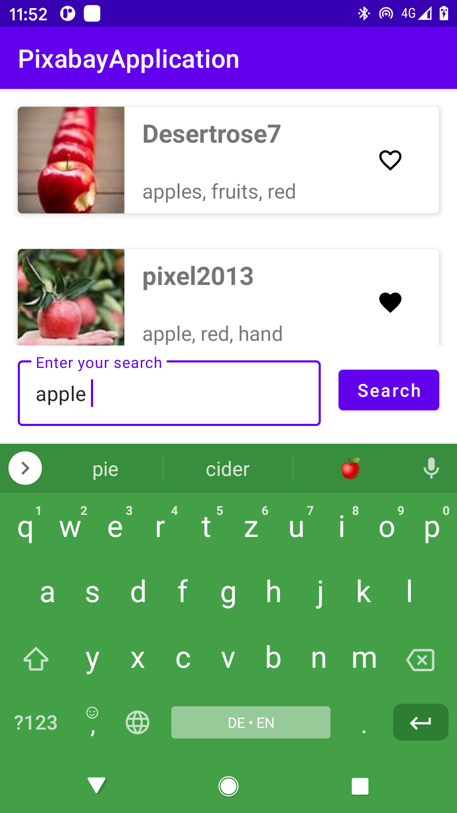

### Coding Example using data binding 

This is a basic android example that uses data binding,
dagger-hilt, navigation component and other basic 
android architecture components. 

To be able to load data you need to create an account 
on pixabay.com and register the apiKey in a file 
next to the project root. 

